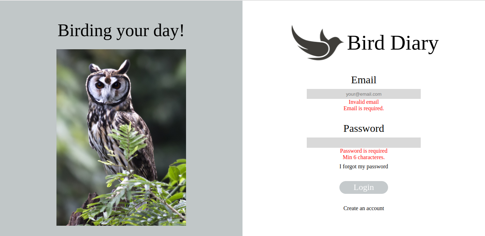
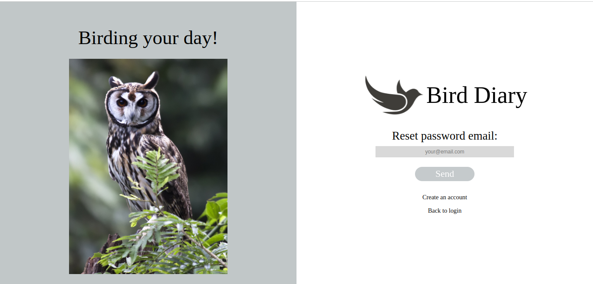
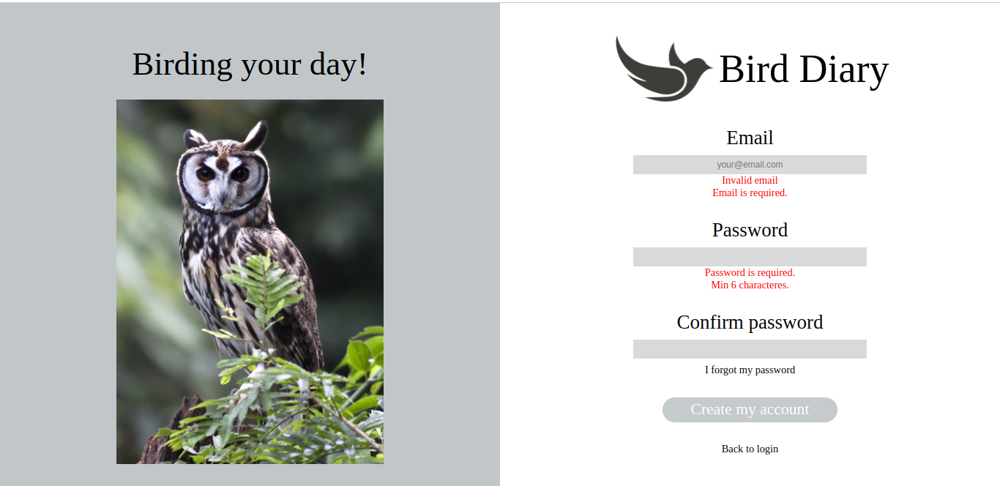
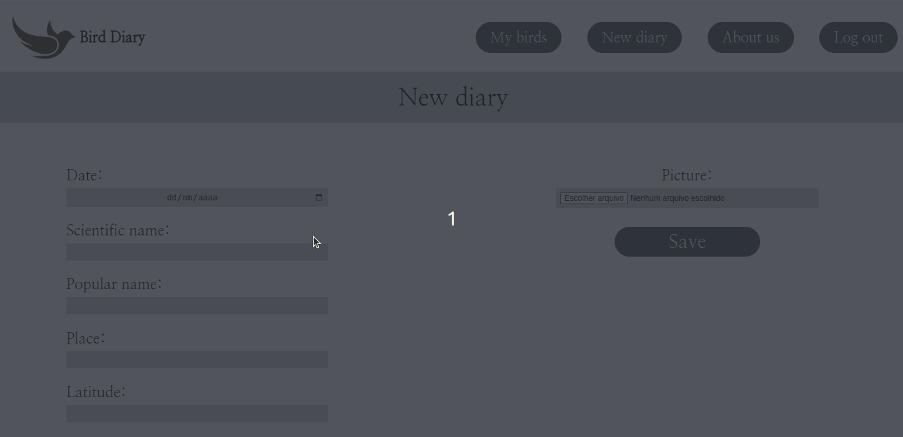
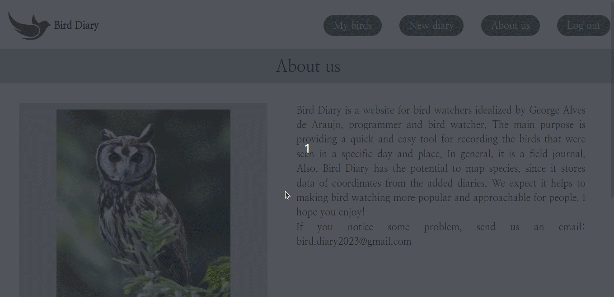
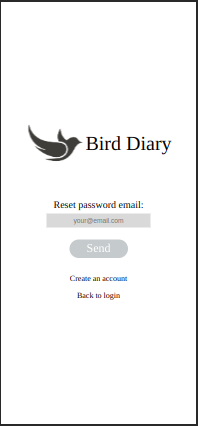
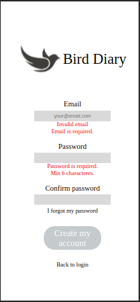
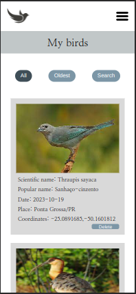
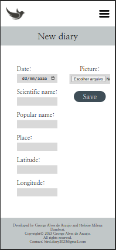
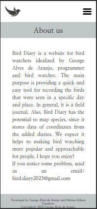

<h1 align="center">
     :bird: <a href="#" alt="site do bird diary"> Bird Diary </a>
</h1>
<h3 align="center">
    Um diário simples e rápido para observadores de pássaros. 
</h3>

     
     

Índice
=================
<!--ts-->
* [Sobre o projeto](#-sobre-o-projeto)
* [Funcionalidades](#-funcionalidades)
* [Layout](#-layout)
     * [Website](#web)
     * [Web
* [Tecnologias](#-tecnologias)
     * [WebSite](#user-content-website)
     * [Servidor](#user-content-server)
* [Autor](#-autor)
* [Licença](#user-content--licença)
<!--te-->

## 🐦 Sobre o projeto

Bird Diary é um website direcionado à observadores de aves. O objetivo principal do projeto é fornecer uma ferramenta simples e rápida para registro de pássaros observados em um determinado dia e local. 

---
## ⚙️ Funcionalidades

- [x] Na parte de autenticação, os usuários podem:
  - [x] Realizar cadastro no site com email e senha.
  - [x] Realizar login.
  - [x] Recuperar a senha.
        
- [x] Depois da etapa de autenticação, os usuários tem acesso às seguintes funcionalidades:
  - [x] Adicionar pássaros observados com as informações de:
      - Nome popular.
      - Nome científico.
      - Local.
      - Latitude e longitude do local (preenchidas automáticamente).
      - Imagem.
  - [x] Visualizar todos os pássaros cadastrados por ele (com opções de filtro e busca por palavras).
  - [x] Atualizar as informações dos pássaros cadastrados.
  - [x] Deletar os pássaros cadastrados.
  - [x] Realizar logout.

- [x] Responsividade para dispositivos móveis (tablets e celulares).

 👀 As funcionalidades descritas podem ser testadas no site oficial do projeto. ➡️ Clique <a href="##">aqui.⬅️ </a>

---
## 🛠️ Tecnologias

As seguintes tecnologias foram utilizadas no projeto:

#### **Website** 
- JavaScript (https://developer.mozilla.org/pt-BR/docs/Web/JavaScript)
     - Manipulação do DOM.
     - Métodos de array.
     - Validação de formulários.
     - Requisições GET e POST.
     - Consumo de API's.
     - Responsividade.
     - Conceitos relacionados à aplicações CRUD. 
- HTML (https://developer.mozilla.org/pt-BR/docs/Web/HTML).
- CSS (https://developer.mozilla.org/pt-BR/docs/Web/CSS).
     - Flexbox.
     - Position.
     - Media queries.
     - Estilização de maneira geral.

#### **Servidor**

- Firebase (https://firebase.google.com/docs?hl=pt-br)
     - Firebase Authentication.
     - Firebase Database.
     - Firebase Cloud Storage.
 
#### **Utilitários**

- Free Geocoding API (https://geocode.maps.co/).
- Visual Studio Code (https://code.visualstudio.com/).

## 🎨 Layout

### Website para desktops.
<h4>Página de login</h4>

<h4 align="center">Página de recuperação de senha</h4>

<h4 align="center">Página de cadastro de usuário</h4>

<h4 align="center">Página inicial</h4>

<h4 align="center">Página de registro de pássaros</h4>

<h4 align="center">Página de informações sobre o site</h4>

### Website mobile.
<h4 align="center">Página de login, recuperação de senha e cadastro de usuário</h4>

     
     
     

<h4 align="center">Página inicial, de registro de novos pássaros e de informações sobre o site</h4>

     
     
     

## 🦸 Autor

George Alves de Araujo. 🚀

 

---

## 📝 Licença

Este projeto está sob a lincença [MIT](./LICENSE).

---

