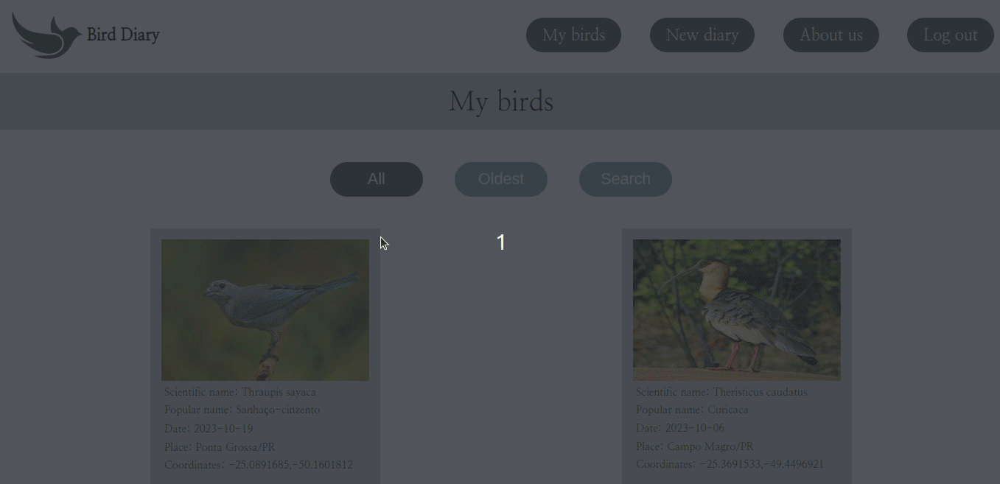

<h1 align="center">
     :bird: <a href="#" alt="site do bird diary"> Bird Diary </a>
</h1>
<h3 align="center">
    Um diário simples e rápido para observadores de pássaros. 
</h3>

     
     

Índice
=================
<!--ts-->
* [Sobre o projeto](#-sobre-o-projeto)
* [Funcionalidades](#-funcionalidades)
* [Layout](#-layout)
     * [Web](#web)
* [Tecnologias](#-tecnologias)
     * [WebSite](#user-content-website)
     * [Servidor](#user-content-server)
* [Autor](#-autor)
* [Licença](#user-content--licença)
<!--te-->

## 🐦 Sobre o projeto

Bird Diary é um website direcionado à observadores de aves. O objetivo principal do projeto é fornecer uma ferramenta simples e rápida para registro de pássaros observados em um determinado dia e local. 

---
## ⚙️ Funcionalidades

- [x] Na parte de autenticação, os usuários podem:
  - [x] Realizar cadastro no site com email e senha.
  - [x] Realizar login.
  - [x] Recuperar a senha.
        
- [x] Depois da etapa de autenticação, os usuários tem acesso às seguintes funcionalidades:
  - [x] Adicionar pássaros observados com as informações de:
      - Nome popular.
      - Nome científico.
      - Local.
      - Latitude e longitude do local (preenchidas automáticamente).
      - Imagem.
  - [x] Visualizar todos os pássaros cadastrados por ele (com opções de filtro e busca por palavras).
  - [x] Atualizar as informações dos pássaros cadastrados.
  - [x] Deletar os pássaros cadastrados.
  - [x] Realizar logout.

- [x] Responsividade para dispositivos móveis (tablets e celulares).

 👀 As funcionalidades descritas podem ser testadas no site oficial do projeto. ➡️ Clique <a href="##">aqui.⬅️ </a>

---
## 🎨 Layout

### Website para desktops.

